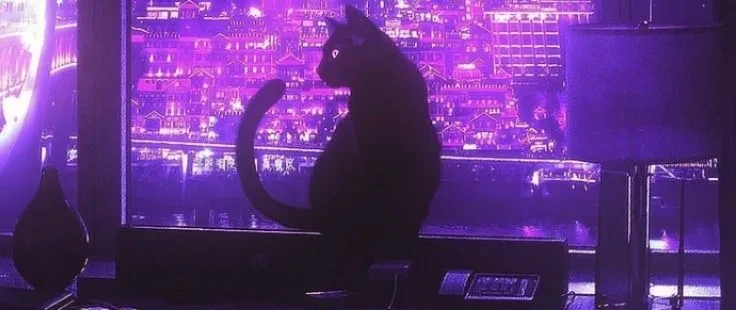

  
  <h1><a href="https://saitomu.lykn.ru/">Saitomu</a></h1>
  
<strong>CTF player · Binary exploitation</strong> Reverse engineering · Linux kernel

  
I explore how systems work beneath the surface, then share what I learn through blogs, notes, and CTF write-ups.

  

    <a href="https://github.com/dungthtd9126">GitHub</a> ·
    <a href="https://hackmd.io/IEqCkk2GRHe3qK5KhcyuGQ">HackMD notes</a> ·
    <a href="https://pwnable.tw/user/40468">pwnable.tw</a>
  

---

## About me

I'm Saitomu, a CTF player exploring binary exploitation, reverse engineering, and Linux kernel internals. I enjoy tracing systems through memory layouts, calling conventions, allocators, and loaders, then documenting how a bug works and how an exploit is built.

> Small steps. Deeper understanding.

## What I enjoy exploring

- **Binary exploitation:** heap primitives, out-of-bounds bugs, format strings, leaks, shellcode, and ROP.
- **Linux kernel:** internals and exploitation techniques such as overflows, use-after-free bugs, and race conditions.
- **Reverse engineering:** understanding how compiled programs behave and where their assumptions break.

## Blogs & write-ups

### HackMD posts

| Post | Focus |
| --- | --- |
| [KCSC Recruitment 2025 — PWN](https://hackmd.io/IEqCkk2GRHe3qK5KhcyuGQ) | PWN challenge analysis and exploitation |
| [KMA CTF 2026](https://hackmd.io/@gbCdQ_ljS7ujEO84BSXzYw/SJAGejUgGl) | PWN challenge write-up notes |

### CTF write-up collections

| Collection | Topics |
| --- | --- |
| [0xlaugh & VSL CTF write-ups](https://github.com/dungthtd9126/0xlaugh-And-VSL-ctf-write-up) | Seccomp, shellcode, format strings, leaks, and ROP |
| [write-up-task-CLB](https://github.com/dungthtd9126/write-up-task-CLB) | Binary exploitation, FSOP, FILE structures, and ret2dlresolve |
| [WU_loc_tv](https://github.com/dungthtd9126/WU_loc_tv) | OOB bugs, heap manipulation, arbitrary read/write, races, and ROP |
| [Linux kernel learning write-ups](https://github.com/dungthtd9126/LK_pwnyable_learning) | Kernel overflows, use-after-free bugs, and race conditions |

### Notes

- [Lac CTF FSOP notes](https://github.com/dungthtd9126/Lac-CTF)
- [CTF note collection](https://github.com/dungthtd9126/CTF-note)
- [Linux kernel notes](https://github.com/dungthtd9126/Kernel/tree/main/linux)
